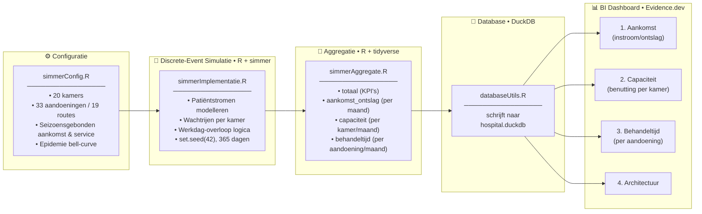

```
 /$$$$$$$  /$$$$$$$$  /$$$$$$  /$$$$$$$  /$$      /$$ /$$$$$$$$
| $$__  $$| $$_____/ /$$__  $$| $$__  $$| $$$    /$$$| $$_____/
| $$  \ $$| $$      | $$  \ $$| $$  \ $$| $$$$  /$$$$| $$      
| $$$$$$$/| $$$$$   | $$$$$$$$| $$  | $$| $$ $$/$$ $$| $$$$$   
| $$__  $$| $$__/   | $$__  $$| $$  | $$| $$  $$$| $$| $$__/   
| $$  \ $$| $$      | $$  | $$| $$  | $$| $$\  $ | $$| $$      
| $$  | $$| $$$$$$$$| $$  | $$| $$$$$$$/| $$ \/  | $$| $$$$$$$$
|__/  |__/|________/|__/  |__/|_______/ |__/     |__/|________/
Theme Hospital • Wachttijden & Benutting dashboard                      
```

### 0. Project management en setup

#### Governance
[Github project](https://github.com/users/ChrismaxR/projects/3/views/18?sliceBy%5Bvalue%5D=Epic)
[Github repo](https://github.com/ChrismaxR/DataBA/tree/main)

### 1. Het probleem

Dr. Van Dalen, COO van Theme Hospital, moet maandelijks kunnen onderbouwen waar capaciteit toegevoegd of herverdeeld moet worden om wachttijden onder controle te houden:

> *"Waar moet ik volgende maand capaciteit toevoegen of herverdelen om wachttijden onder X te houden?"*

Haar informatiebehoefte (zie ook `dashboard/pages/index.md`):
1. Wat zijn de wachttijden in het ziekenhuis?
2. Wat is de benuttingsgraad van de behandelkamers?
3. Is de verhouding met de zorgcapaciteit in balans?
4. Hoe ontwikkelen benutting en capaciteit zich door de tijd?
5. Kunnen benutting en capaciteit gemodelleerd worden voor forecasts?

### 2. Waarom deze data?

- Theme Hospital ❤️ Wat was Theme Hospital ook al [weer](https://www.nme.com/features/gaming-features/why-theme-hospital-is-the-greatest-of-the-simulation-satires-3096680)?

> "De synthetische dataset is afgeleid van een discrete-event simulatie.
> Operationele afhankelijkheden (zoals kamerbeschikbaarheid) worden opgelost tijdens datageneratie.
> De fact-tabellen representeren analytische snapshots en zijn niet bedoeld als transactielog."

### 3. Architectuur



### 4. Projectstructuur

```
src/
  generateScripts/
    simmerConfig.R          # resources, trajecten, aandoeningen, seizoensschema's
    simmerImplementatie.R   # de discrete-event simulatie zelf
    simmerAggregate.R       # bron -> simuleert + aggregeert naar rapportagetabellen
  databaseScripts/
    databaseUtils.R         # schrijft geaggregeerde tabellen naar hospital.duckdb
  statsScripts/
    simmerStatistics.R      # aanvullende statistieken & rapportplots
    rapporten/               # gegenereerde performance-plots per run

dashboard/                  # Evidence.dev site (leest hospital.duckdb)
  pages/                    # 1. Aankomst, 2. Capaciteit, 3. Behandeltijd, 4. Architectuur
  sources/hospital/          # SQL-bronnen + hospital.duckdb

docs/                       # AGENTS.md (resource/traject/aandoening-mapping), story-artefacten
storytelling/                # Quarto-verhaal
visualisatie/                 # losse verkenningen (blockr, dashboard prototypes)
recourses/                    # achtergrondliteratuur over discrete-event simulatie
oud/                         # gearchiveerde/verouderde scripts en dashboardpagina's
```

### 5. Hoe lokaal draaien

```bash
# Data genereren + aggregeren + wegschrijven naar DuckDB
Rscript src/generateScripts/simmerAggregate.R
Rscript src/databaseScripts/databaseUtils.R

# Dashboard
cd dashboard
npm run dev        # dev-server met auto-refresh
npm run build      # productie-build
npm run preview    # preview van productie-build
npm run sources    # databronnen valideren
```

### 6. Key metrics & assumptions

_TODO_

### 7. Dashboard screenshots

_TODO_

### 8. Wat ik nog zou verbeteren

- predictive modelling
- priority queueing - patiënten met een hogere prioriteit (zoals ongelukken en noodgevallen)
- multiple stakeholders with conflicting interests
- scenario's bouwen: wat als we meer kamers hadden gehad/meer patiënten te verstouwen hadden gehad, enz.
- ~~seasonal influences on utilization and queue length~~ -> done! aankomst- en servicetijd-schema's per kwartaal (zie `simmerConfig.R`)
- ~~epidemic simulation~~ -> done! Infectious Laughter epidemie met een bellcurve-piek midden in het jaar (zie `simmerConfig.R`)

Openstaande iteraties (zie `todo.txt`):
- capaciteitpagina: top/bottom 8–10 kamers tonen
- aankomstpagina visueel aantrekkelijker maken
- filters op behandeltijdpagina herstellen
- meer variabiliteit in patiënttoeloop en behandeltijd-patronen
