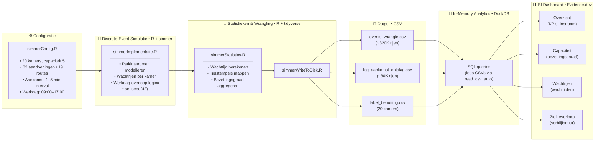

```
 /$$$$$$$  /$$$$$$$$  /$$$$$$  /$$$$$$$  /$$      /$$ /$$$$$$$$
| $$__  $$| $$_____/ /$$__  $$| $$__  $$| $$$    /$$$| $$_____/
| $$  \ $$| $$      | $$  \ $$| $$  \ $$| $$$$  /$$$$| $$      
| $$$$$$$/| $$$$$   | $$$$$$$$| $$  | $$| $$ $$/$$ $$| $$$$$   
| $$__  $$| $$__/   | $$__  $$| $$  | $$| $$  $$$| $$| $$__/   
| $$  \ $$| $$      | $$  | $$| $$  | $$| $$\  $ | $$| $$      
| $$  | $$| $$$$$$$$| $$  | $$| $$$$$$$/| $$ \/  | $$| $$$$$$$$
|__/  |__/|________/|__/  |__/|_______/ |__/     |__/|________/
Theme Hospital • Wachttijden & Benutting dashboard                      
```
                                                                                                         
### 0.  Project management en setup

#### Governance
[Github project](https://github.com/users/ChrismaxR/projects/3/views/18?sliceBy%5Bvalue%5D=Epic)
[Github repo](https://github.com/ChrismaxR/DataBA/tree/main)

### 1.	Het probleem


### 2.	Waarom deze data?

- Theme Hospital ❤️ Wat was Theme Hospital ook al [weer](https://www.nme.com/features/gaming-features/why-theme-hospital-is-the-greatest-of-the-simulation-satires-3096680)?

> “De synthetische dataset is afgeleid van een discrete-event simulatie.
> Operationele afhankelijkheden (zoals kamerbeschikbaarheid) worden opgelost tijdens datageneratie.
> De fact-tabellen representeren analytische snapshots en zijn niet bedoeld als transactielog.”


### 3.	Architectuur (1 diagram, simple)



### 4.	Key metrics & assumptions

### 5.	Dashboard screenshots(gif?)

### 6.	What I would improve with more time

- predictive modelling
- seasonal influences on utilization and queue length
- epidemic simulation
- priority queueing - patiënten met een hogere prioriteit (zoals ongelukken en noodgevallen)
- multiple stakeholders with conflicting interests
- scenarios bouwen: wat als we meer kamers hadden gehad/meer patiënten te verstouwen hadden gehad, enz.