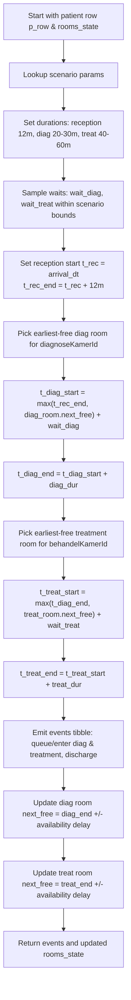

```mermaid
  flowchart TD
    A[Start with patient row p_row & rooms_state] --> B[Lookup scenario params]
    B --> C[Set durations: reception 12m, diag 20-30m, treat 40-60m]
    C --> D[Sample waits: wait_diag, wait_treat within scenario bounds]
    D --> E[Set reception start t_rec = arrival_dt<br>t_rec_end = t_rec + 12m]
    E --> F[Pick earliest-free diag room for diagnoseKamerId]
    F --> G["t_diag_start = max(t_rec_end, diag_room.next_free) + wait_diag"]
    G --> H[t_diag_end = t_diag_start + diag_dur]
    H --> I[Pick earliest-free treatment room for behandelKamerId]
    I --> J["t_treat_start = max(t_diag_end, treat_room.next_free) + wait_treat"]
    J --> K[t_treat_end = t_treat_start + treat_dur]
    K --> L[Emit events tibble: queue/enter diag & treatment, discharge]
    L --> M[Update diag room next_free = diag_end +/- availability delay]
    M --> N[Update treat room next_free = treat_end +/- availability delay]
    N --> O[Return events and updated rooms_state]
```
