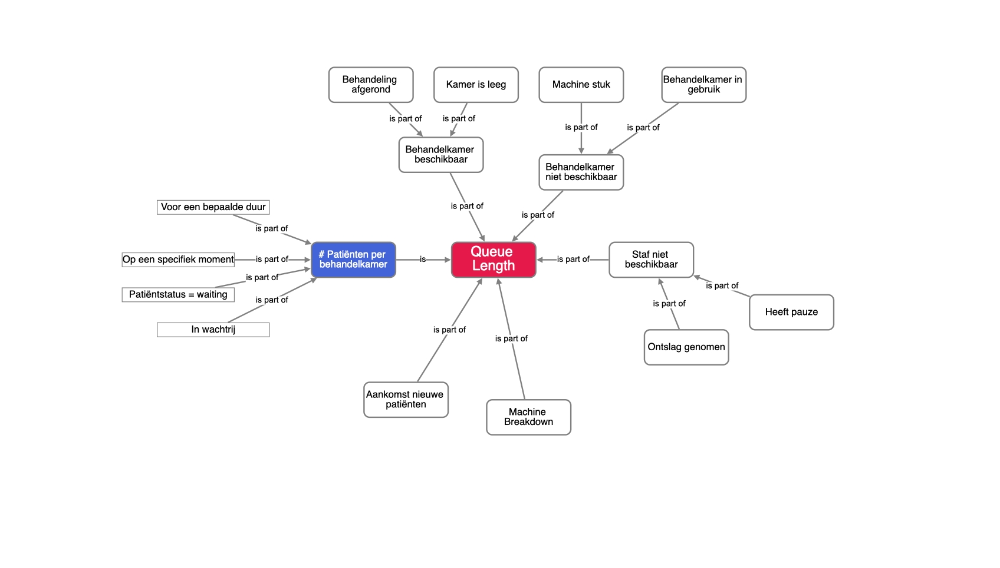
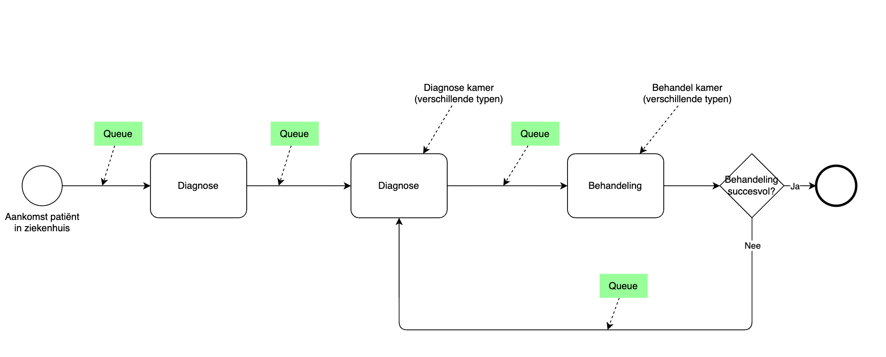

# Story 2 - Persona beschrijving

Op te leveren artefacten:
• Stakeholderprofiel (archetype/persona)
• Beschrijving van gebruikersdoelen en besliscontext
• Overzicht van primaire informatiebehoeften en pijnpunten

## Persona: Ziekenhuisbestuurde die "Queue length" moet managen.

### Persona

Dit is Dr. Marieke van Dalen, COO bij ThemeHospital in ThemeVille. Zij is 44 jaar en zij vervult al een aantal jaren haar rol in het ziekenhuis. Ze voelt zich betrokken bij het ziekenhuis en het algemene welbevinden van patiënten en medewerkers in Theme Hospital. Een van haar centrale richtpunten is een fluïde doorloop van het zorgsysteem in het ziekenhuis: van aankomst tot afronding van de juiste behandeling. Hierbij ligt de sleutel in het effectief managen van wachttijden voor patiënten ten behoeve van een diagnose of een behandeling. In Theme Hospital wordt in de zin van wachttijden gesproken over "Queue Length". 

> Centrale vraag van Marieke: “Waar moet ik volgende maand capaciteit toevoegen of herverdelen om wachttijden onder X te houden?”

## Besluitcontext

"Queue Length" management is een belangrijke factor in:
- patiënt gezondheid en welbevinden
- operationele "excellence" van organisatie
- cashflow van het ziekenhuis
- reputatie van het ziekenhuis

Theme Hospital kent een maandelijkse cyclus om te rapporteren en om de operatie op dit vlak te reviewen.

Queue Lenght is zelf als volgt te begrijpen:

### Informatiebehoefte van Marieke:
1. Wat zijn wachttijden in mijn ziekenhuis? 
2. Wat is de benuttingsgraad van mijn behandelkamers in mijn ziekenhuis?
3. Is de verhouding met mijn zorgcapaciteit in balans?
4. Hoe ontwikkelt benutting door de tijd?
5. Hoe ontwikkelt capaciteit zich door de tijd?
6. Welke tools heb ik om eventuele problemen te voorkomen?
7. Kan ik benutting en capaciteit modelleren om forecasts te draaien?

## Model van queues in Theme Hospital

