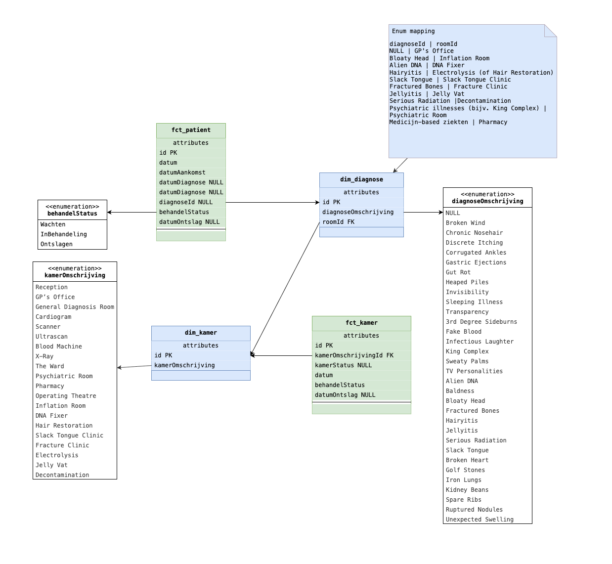

# Story 4 - Identificeer mogelijke datasets

## 🏆 Op te leveren artefacten

- Een eerste beschrijving/schets van een ruwe data
- Buiten scope zijn aggregatie tabellen maar ruwe data moet aggregaties wel mogelijk maken
- Een eerste opzet van reverse engineering van Theme Hospital data.
- Een eerste schets van een gegevensmodel

### 👷‍♂️ Reverse Engineer Theme Hospital data

#### 🏥 Overzicht kamer-typen

| Diagnose kamers        | Behandelkamers    | Klinieken           | Faciliteiten |
|------------------------|-------------------|---------------------|--------------|
| GP’s Office            | Pharmacy          | Inflation Room      | Toilets      |
| General Diagnosis Room | Psychiatric Room  | Decontamination     | Staff Room   |
| Cardiogram             | The Ward          | DNA Fixer           | Research Dept|
| Scanner                | Operating Theatre | Hair Restoration    | Training Room|
| Ultrascan              |                   | Slack Tongue Clinic | Waiting Room |
| Blood Machine          |                   | Fracture Clinic     |              |
| X-Ray                  |                   | Electrolysis        |              |
| The Ward               |                   | Jelly Vat           |              |
| Psychiatric Room       |                   |                     |              |

**Nota Bene:**
The Ward: diagnose + behandeling
Psychiatric Room: diagnose + behandeling

#### 🦠 Aandoeningen Behandelroutes voor patiënten

| aandoening           | aanmelden  | diagnose           | behandeling             | behandelroute |
|----------------------|------------|--------------------|-------------------------|----------|
| Sleeping Illness     | receptie   | GP's Office        | The Ward                | A        |
| Discrete Itching     | receptie   | GP's Office        | The Ward                | A        |
| Fake Blood           | receptie   | GP's Office        | The Ward                | A        |
| The Squits           | receptie   | GP's Office        | Pharmacy                | B        |
| Sweaty Palms         | receptie   | GP's Office        | Pharmacy                | B        |
| Gastric Ejections    | receptie   | GP's Office        | Pharmacy                | B        |
| Uncommon Cold        | receptie   | GP's Office        | Pharmacy                | B        |
| Chronic Nosehair     | receptie   | GP's Office        | Electrolysis            | C        |
| Hairyitis            | receptie   | GP's Office        | Electrolysis            | C        |
| Baldness             | receptie   | GP's Office        | Hair Restoration Clinic | D        |
| King Complex         | receptie   | GP's Office        | Psychiatric Room        | E        |
| Infectious Laughter  | receptie   | GP's Office        | Psychiatric Room        | E        |
| TV Personalities     | receptie   | GP's Office        | Psychiatric Room        | E        |
| Ruptured Nodules     | receptie   | General Diagnosis  | Operating Theatre       | F        |
| Broken Wind          | receptie   | General Diagnosis  | Operating Theatre       | F        |
| Golf Stones          | receptie   | General Diagnosis  | Operating Theatre       | F        |
| Iron Lungs           | receptie   | General Diagnosis  | Operating Theatre       | F        |
| Gut Rot              | receptie   | General Diagnosis  | Pharmacy                | G        |
| Heaped Piles         | receptie   | General Diagnosis  | Pharmacy                | G        |
| 3rd Degree Sideburns | receptie   | General Diagnosis  | Electrolysis            | H        |
| Bloaty Head          | receptie   | General Diagnosis  | Inflation Room          | I        |
| Slack Tongue         | receptie   | General Diagnosis  | Slack Tongue Clinic     | J        |
| Broken Heart         | receptie   | Cardiogram         | Fracture Clinic         | K        |
| Spare Ribs           | receptie   | X-Ray              | Fracture Clinic         | K        | 
| Corrugated Ankles    | receptie   | X-Ray              | Fracture Clinic         | K        |
| Fractured Bones      | receptie   | X-Ray              | Fracture Clinic         | K        |
| Kidney Beans         | receptie   | X-Ray              | Operating Theatre       | L        | 
| Unexpected Swelling  | receptie   | X-Ray              | Pharmacy                | M        |
| Serious Radiation    | receptie   | X-Ray              | Decontamination Room    | N        |
| Jellyitis            | receptie   | Scanner            | Jelly Vat               | O        |
| Transparency         | receptie   | Scanner            | Pharmacy                | P        |
| Invisibility         | receptie   | Ultrascan          | Pharmacy                | P        |
| Alien DNA            | receptie   | Ultrascan          | DNA Fixer               | Q        |

**NB** Dit is versimpeld ten op zichte van het echte spel, want daar kunnnen meerdere diagnose stappen zitten voordat een patiënt bij een behandelkamer uitkomt, maar ik voorzie dat dit te veel complexiteit oplevert in dit project. Ik heb daarom hier een vrije en versimpelde interpretatie gemaakt. 

Hier volgt ook uit een aantal scenarios die ik op kan zetten die een gemeenschappelijk verloop kennen, hiervoor 

### 📊 Benodigde ruwe data

|  id | onderwerp  | operationalisatie                       | psuedoCode                                                                       | inDataModel? |
|-----|------------|-----------------------------------------|----------------------------------------------------------------------------------|--------------|
|   1 | Capaciteit |  # potentiële te benutten behandelkamers| count(fct_kamer.id) where fct_kamer.kamerStatus == "InGebruik"                   |  True        |
|   2 | Capaciteit |  # behandelkamers met kapotte mach.     | count(fct_kamer.id) where fct_kamer.kamerStatus == "MachineKapot"                |  True        |
|   3 | Capaciteit |  # behandelkamers zonder personeel      | count(fct_kamer.id) where fct_kamer.kamerStatus == "Pauze/Ontslag"               |  True        |
|   4 | Capaciteit |  Breakdown zonder pers. (pauze/ontslag) | group by(kamerStatus == "Pauze"/"Ontslag")                                       |  True        |
|   5 | Ziekte     |  # patiënten                            | count(fct_patient.id) where fct_patient.behandelStatus != "Ontslagen"            |  True        |
|   6 | Ziekte     |  # patiënten per specialisme            | zelfde als id = 5 + group by(behaldelkamerId)                                    |  True        |
|   7 | Ziekte     |  # patiënten met/zonder diagnose        | count(fct_patient.id) where fct_patient.behandelStatus != "WachtenOpDiagnose"    |  True        |
|   8 | Ziekte     |  # patiënten met diagnose               | zelfde als id = 7 where fct_patient.behandelStatus == "WachtenOpBehandeling"     |  True        |
|   9 | Queue      |  # patiënten aan het wachten            | count(fct_patient.id) where str_detect(fct_patient.behandelStatus, "^Wachten")   |  True        |
|  10 | Queue      |  Gem. tijd in de wacht                  | Δfct_patient.datumTijd between fct_patient.behandelStatus in ("^Wachten"/ "^In)  |  True        |
|  11 | Queue      |  Gem. tijd in de wacht per specialisme  | zelfde als id = 10 + group by dim_diagnose.kamerTypeId                           |  True        |
|  12 | Benutting  |  Tijd per tijdseenheid kamer in gebruik | Δfct_kamer.datumTijd between fct_kamer.kamerStatus                               |  True        |
|  13 | Benutting  |  Benuttingsgraad per specialisme        | zelfde als id = 12 + group by fct_kamer.kamerTypeId                              |  True        | 

De pseudocode helpt al een beeld vormen van wat voor queries ik denkstraks nodig te hebben voor het echte data wrangle-werk. 

### 🗺️ Gegevensmodel

